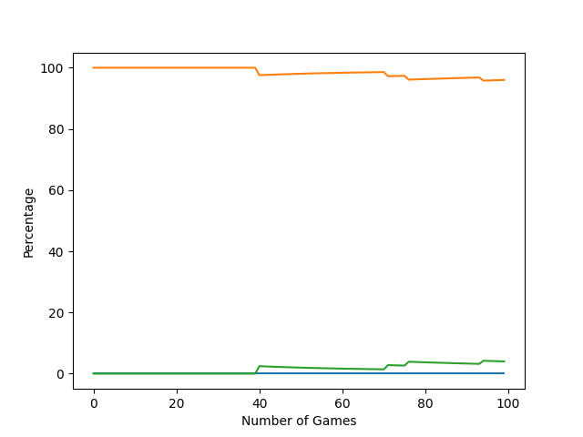

# Tic-Tac-Toe_AI  
An implementation of a tic-tac-toe solver using various AI and Machine Learning algorithms.  
  
### Usage  
```  
python3 main.py  
```  
  
# Currently Implemented Models  
1. [Monte Carlo Tree Search (MCTS)](#mcts-vs-optimal)  
2. [Tabular Q-Learning](#q-table-vs-optimal)
3. [Random](#random-vs-optimal)  
4. [Optimized (manually programmed to always play best moves)](https://xkcd.com/832/) 
  
# Planned Models   
1. Neural Network  
2. Convelutional Neural Network + MCTS  
  
  
# Test Results  
  
### MCTS vs Optimal
  
 
The following graph shows the Win, Draw, and Loss percentages over 100 training games of a **MCTS** model, configured with a 1000 playout per move sampling rate, playing against an **Optimal Agent**. After much testing, 5000 playouts per move seemed to be close to the ideal configuration for maximizing model performance.  
  
    
MCTS Win Percentage: 0.0%      
MCTS Draw Percentage: 96.0%      
MCTS Loss Percentage: 4.0% 
***  
### Q-Table vs Optimal  
  
The following graph shows the Win, Draw, and Loss percentages over 10,000 training games of a standard **Tabular Q-Learning** model playing against an **Optimal Agent**.  
  
    
Q-Table Win Percentage: 0.00%      
Q-Table Draw Percentage: 96.91%      
Q-Table Loss Percentage: 3.09% 
***  
### Random vs Optimal  
  
The following graph shows the Win, Draw, and Loss percentages over 10,000 training games of a **Random** agent playing against an **Optimal Agent**.  
  
    
Q-Table Win Percentage: 0.00%      
Q-Table Draw Percentage: 8.61%      
Q-Table Loss Percentage: 91.39%
